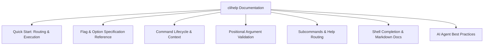

# Documentation Audit & Enhancement Proposal for `clihelp`

## Executive Summary

The `clihelp` package underwent a major evolution in `v0.2.x`, transitioning from a pure help-text formatting library into a full declarative CLI application framework with `pflag`-backed flag parsing, argument validation, and hierarchical routing. 

However, the existing documentation (`README.md` and package comments) primarily reflects its legacy help-formatter origins. Critical execution patterns, flag specification syntax, lifecycle hooks, and error-handling nuances remain undocumented or buried inside `example/` code. This creates friction for human engineers and leads AI agents into syntax hallucinations and runtime panics.

This document outlines the deficiencies in the current `clihelp` documentation and presents a comprehensive specification for what must be added to make `clihelp` intuitive and dependable for both humans and AI agents.

---

## 1. Identified Deficiencies

### A. Missing Execution & Routing Lifecycle Documentation
- **No Explanation of `Execute` / `ExecuteContext`**: The main README focuses entirely on `app.Render(...)`. `App.Execute(args)` and `App.ExecuteContext(ctx, args)` are the primary execution entry points for running CLIs, yet they are not documented in the main workflow section.
- **Undocumented Execution Pipeline**: The package implements a full lifecycle:
  $$\text{Resolve Command} \rightarrow \text{Bind Flags} \rightarrow \text{Parse Flags} \rightarrow \text{Validate Args} \rightarrow \text{BeforeRun} \rightarrow \text{PreRun} \rightarrow \text{Run} \rightarrow \text{PostRun} \rightarrow \text{AfterRun}$$
  None of the hook execution order, abort semantics (returning an error from any hook halts downstream execution), or context propagation are explained.
- **Unclear Role of `clihelp.Context`**: The fields available in `*clihelp.Context` (`Context`, `App`, `Command`, `Args`, `RawArgs`, `Stdout`, `Stderr`) are omitted from the documentation.

### B. Undocumented Flag Specification Syntax & Option Constructors
- **String Flag Spec Syntax**: `parseFlagSpec` supports sophisticated flag strings (e.g., `"-p, -P, --podcast <podcast>"`, `"--[no-]check-new"`, `"-o, --output PATH"`), but the format rules are nowhere to be found:
  - Multiple short flags (`-p, -P`)
  - Multiple long flags (`--podcasts-dir, --podcasts_dir`)
  - Toggle syntax (`--[no-]flag`)
  - Placeholder / value hints (`<name>`, `PATH`, `[value]`)
- **Missing Constructor Reference Table**: `clihelp.String`, `clihelp.Int`, `clihelp.Bool`, `clihelp.BoolToggle`, `clihelp.Duration`, `clihelp.StringSlice`, `clihelp.Enum`, and `clihelp.Var` lack a reference table specifying parameter signatures, default value assignment, and type conversion behavior.

### C. Critical Trap: Automatic Help Flag Collision
- **Implicit `-h` / `--help` Binding**: When `App.Execute()` executes, `clihelp` automatically binds `-h` and `--help` to every command flagset.
- **Runtime Panic Risk**: If a developer or AI agent explicitly declares a help option (e.g. `clihelp.Bool(..., "-h, --help", ...)`), `pflag` panics at runtime with `panic: help flag redefined: help`. The documentation never warns about this behavior.

### D. Positional Argument Validation
- **Missing Validator Documentation**: `ArgsValidator` functions (`ExactArgs(n)`, `MinimumNArgs(n)`, `MaximumNArgs(n)`, `RangeArgs(min, max)`, `NoArgs`) are implemented in `args.go` but absent from the README API reference.
- **Interaction with `ctx.Args` vs `fs.Args()`**: No explanation that flags are stripped before validators run, and that valid positional arguments populate `ctx.Args`.

### E. Subcommand Hierarchy & `help` Command Routing
- **Built-in `help` Interceptor**: `resolveCommand` natively intercepts `help <subcommand>` arguments (e.g. `app help scan`) if no custom command named `"help"` is registered. The documentation does not clarify whether users should register a custom `help` command or rely on the native resolver.
- **Command Suggestions**: The Levenshtein distance typo suggestion mechanism (`Did you mean "scan"?`) is undocumented.

### F. Shell Autocompletion Architecture
- **Undocumented `__complete` Protocol**: `clihelp` includes complete bash, fish, and zsh completion generators (`GenBashCompletion`, `GenFishCompletion`, `GenZshCompletion`, `Complete` callbacks on options). The documentation contains no instructions on how to wire completion commands (e.g., `app completion bash`).

---

## 2. Proposed Documentation Structure & Additions

To resolve these issues, the documentation should be updated with the following structured sections:



---

## 3. Recommended Content Additions

### Section 1: Application Execution & Lifecycle Reference

```go
app := &clihelp.App{
    Name:        "mycli",
    Description: "Tool description",
    Version:     "1.0.0",
    BeforeRun: func(ctx *clihelp.Context) error {
        // Global pre-flight (e.g., load config, init logger)
        return nil
    },
    Commands: []clihelp.Command{
        {
            Name:        "build",
            Description: "Compile targets",
            UsageLine:   "mycli build [options] <target>",
            Args:        clihelp.ExactArgs(1),
            PreRun:      func(ctx *clihelp.Context) error { return nil },
            Run: func(ctx *clihelp.Context) error {
                target := ctx.Args[0] // Validated positional argument
                fmt.Fprintf(ctx.Stdout, "Building %s...\n", target)
                return nil
            },
            PostRun:     func(ctx *clihelp.Context) error { return nil },
        },
    },
    AfterRun: func(ctx *clihelp.Context) error {
        // Global cleanup
        return nil
    },
}

// Execute parses os.Args[1:], routes commands, runs lifecycle hooks, and prints errors.
if err := app.Execute(os.Args[1:]); err != nil {
    clihelp.PrintError(err)
    os.Exit(1)
}
```

### Section 2: Flag Specification Reference Table

| Constructor | Spec Example | Description & Default Value Handling |
|---|---|---|
| `clihelp.String(target, spec, default, usage)` | `"-o, --output <file>"` | Binds string flag. Sets `*target = default`. |
| `clihelp.Int(target, spec, default, usage)` | `"-k, --count <num>"` | Binds integer flag. |
| `clihelp.Bool(target, spec, default, usage)` | `"-v, --verbose"` | Binds boolean flag (`true` when passed). |
| `clihelp.BoolToggle(target, spec, default, usage)` | `"--[no-]cache"` | Registers both `--cache` (`true`) and `--no-cache` (`false`). |
| `clihelp.Duration(target, spec, default, usage)` | `"-t, --timeout <dur>"` | Binds `time.Duration` (e.g. `"30s"`, `"1m"`). |
| `clihelp.StringSlice(target, spec, default, usage)` | `"-i, --include <item>"` | Binds repeatable / comma-separated string slice. |
| `clihelp.Enum(target, spec, allowed, default, usage)` | `"-m, --mode <mode>"` | Restricts string input to `allowed` options. |
| `clihelp.Var(targetValue, spec, usage)` | `"--custom <val>"` | Binds custom `pflag.Value` implementation. |

> [!CAUTION]
> **Do not define `-h` or `--help` in `Options`**: `clihelp` automatically binds help flags to all commands during execution. Explicitly registering a help flag will cause a `panic: help flag redefined: help`.

### Section 3: Positional Argument Validators

| Validator | Behavior |
|---|---|
| `clihelp.NoArgs` | Enforces 0 positional arguments. |
| `clihelp.ExactArgs(n)` | Enforces exactly `n` positional arguments. |
| `clihelp.MinimumNArgs(n)` | Enforces at least `n` positional arguments. |
| `clihelp.MaximumNArgs(n)` | Enforces at most `n` positional arguments. |
| `clihelp.RangeArgs(min, max)` | Enforces between `min` and `max` positional arguments. |

### Section 4: AI Agent Prompting Guidelines & Rules

When building or refactoring applications with `clihelp`, AI coding agents should follow these rules:

1. **Target Variable Binding**: Always pass addresses of fields in a persistent configuration or options struct (e.g., `&opts.Host`).
2. **Never Add Manual `-h`/`--help` Options**: Let `clihelp` manage the help flag binding and rendering automatically.
3. **Use Subcommands for Nested Workflows**: Model nested subcommands (e.g. `config processor set`) via `Command.Subcommands` instead of manual token parsing in `Run`.
4. **Use `ctx.Args` for Positional Parameters**: In `Run` handlers, always read positional parameters from `ctx.Args` rather than inspecting `os.Args`.
5. **Use `clihelp.PrintError(err)`**: Standardizes error formatting across CLI tools with red bold highlights.
